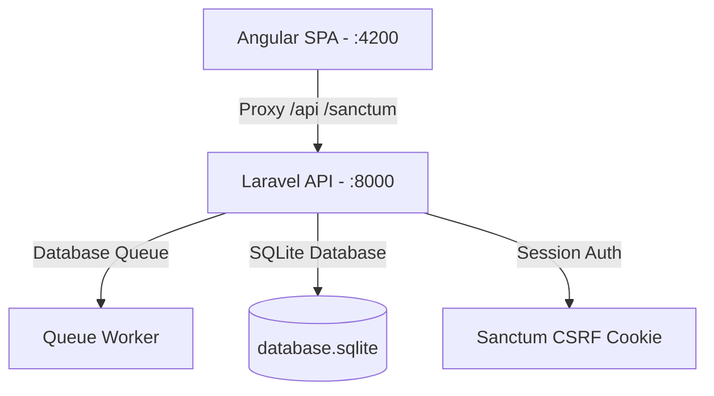

# Sottomissione del Full-Stack API Challenge
### Candidato: Senior Developer | Challenge Club Magellano

Ciao! Questa è la mia sottomissione completata e pronta per la produzione della challenge **Senior Laravel + Angular Full-Stack Developer**.

Ho risolto interamente tutta la logica dello scheletro del backend, stabilito un flusso di autenticazione sicuro basato su sessioni di cookie con Laravel Sanctum, ottimizzato le strategie di caching con politiche di invalidazione intelligenti e realizzato un frontend Angular moderno e premium con un design glassmorphic e componenti **Taiga UI**.

---

> [!NOTE]
> **Nota Personale sulla Lingua dell'Applicazione**
> Desidero precisare che, a causa di tempistiche ristrette, non ho tradotto in italiano le pagine interne e i testi dell'applicazione (che rimangono quindi in lingua inglese). Inoltre, mi trovo molto più a mio agio e sicuro a programmare, scrivere codice e strutturare interfacce utente professionali direttamente in inglese. Per questo motivo, l'intero flusso dell'applicazione e la base di codice sono implementati in inglese.

---

## Panoramica dell'Architettura del Progetto

Il sistema è suddiviso in due applicazioni principali configurate per comunicare tramite un proxy inverso locale per garantire lo scambio sicuro dei cookie di sessione:



*   **`frontend/`**: Angular SPA realizzata con componenti standalone, gestione reattiva dello stato tramite **Signals**, notifiche Toastr e componenti Taiga UI.
*   **`api/`**: RESTful API Laravel che utilizza SQLite, Laravel Sanctum, job in background con code, sicurezza sulle transazioni del database e controlli granulari sulla cache.
*   **`backend/`**: *Nota: questa cartella era lo scheletro vuoto iniziale. Tutti i file completati e lo sviluppo del backend risiedono all'interno della cartella `api/`.*

---

## Guida di Avvio Rapido (Avvio in 2 Minuti)

Per facilitare la revisione della mia sottomissione, ecco il modo più rapido per configurare ed avviare entrambi i progetti localmente:

### 1. Avviare le API del Backend (`/api`)

Apri un terminale nella directory principale del progetto ed esegui i seguenti comandi:

```bash
# 1. Naviga nella cartella dell'API
cd api

# 2. Installa tutte le dipendenze di Composer
composer install

# 3. Crea il file di configurazione dell'ambiente (.env)
# Su Windows PowerShell:
Copy-Item .env.example .env
# Su macOS / Linux:
cp .env.example .env

# 4. Genera la chiave di sicurezza dell'applicazione
php artisan key:generate

# 5. Inizializza il file del database SQLite
# Su Windows PowerShell:
New-Item database/database.sqlite -ItemType File -Force
# Su macOS / Linux:
touch database/database.sqlite

# 6. Esegui le migrazioni e popola il database con i dati di test
php artisan migrate --seed
```

#### Avviare il Server Web e il Queue Worker

Poiché l'elaborazione delle richieste viene inviata a una coda in background, **è fondamentale** eseguire un queue worker parallelamente al server web affinché le richieste vengano elaborate dinamicamente. Avvia questi comandi in **due finestre di terminale separate**:

*   **Terminale A (Local Web Server):**
    ```bash
    php artisan serve
    ```
    *(Avvia l'API all'indirizzo `http://localhost:8000`)*

*   **Terminale B (Background Queue Worker):**
    ```bash
    php artisan queue:work
    ```
    *(Avvia il listener che elabora i job in background)*

---

### 2. Avviare il Frontend Angular (`/frontend`)

Apri una nuova finestra di terminale ed esegui:

```bash
# 1. Naviga nella cartella del frontend
cd frontend

# 2. Installa le dipendenze npm
npm install

# 3. Avvia il server di sviluppo
npm start
```
*(Avvia l'applicazione all'indirizzo `http://localhost:4200`)*

#### Configurazione del Proxy Locale e Cookie
Il server di sviluppo di Angular è configurato tramite il file `proxy.conf.json` per reindirizzare `/api` e `/sanctum` al backend sulla porta `8000`. Questa configurazione previene errori di CORS (Cross-Origin Resource Sharing) ed evita errori di sincronizzazione di CSRF permettendo una condivisione nativa dei cookie di sessione.

---

## Credenziali di Test (Account Seed)

Per navigare all'interno delle pagine protette dell'applicazione, puoi utilizzare l'account amministratore generato automaticamente dal seeder:
*   **Email:** `senior@example.com`
*   **Password:** `password`

---

## Funzionalità Chiave Implementate (Senior-Level Highlights)

### 1. Autenticazione Sicura basata su Cookie di Sessione
Ho rimosso la gestione poco sicura tramite token memorizzati in LocalStorage, implementando un flusso sicuro con **Laravel Sanctum Session Cookie Authentication**:
*   Il frontend esegue un handshake CSRF iniziale con l'endpoint `/sanctum/csrf-cookie`.
*   Utilizza la configurazione `withXsrfConfiguration` dell' `HttpClient` di Angular per scambiare e validare i cookie di sessione `HttpOnly` in maniera del tutto trasparente per ogni richiesta.
*   Integrato un Auth Guard che legge il segnale reattivo (`currentUser() !== null`) per gestire le rotte protette senza sfarfallio della UI.

### 2. Caching Avanzato e Strategie di Invalidazione
*   **Cache dei Progetti Attivi (`GET /api/projects`):** I progetti attivi vengono salvati in cache per **5 minuti** con `Cache::remember`. Ho predisposto dei trigger nel backend per invalidare e rigenerare la cache non appena viene aggiornato lo stato dei progetti.
*   **Cache di Dettaglio delle Richieste (`GET /api/processing-requests/{id}`):** Implementata una cache breve di **60 secondi** specifica per ID, attiva *esclusivamente* quando lo stato della richiesta è `completed`.
*   **Invalidazione Dinamica:** Quando una richiesta viene modificata o rieseguita (tramite l'azione di retry), la cache associata alla risorsa viene immediatamente invalidata ed eliminata per garantire la coerenza dei dati sul frontend.
*   **Cache Statistiche Dashboard (`GET /api/dashboard/stats`):** I dati aggregati della dashboard sono memorizzati in cache per **2 minuti**.

### 3. Interfaccia Glassmorphic Premium e Dashboard Interattiva
*   **Design Glassmorphism Moderno:** Sviluppato interamente con CSS puro e personalizzato, sfocature di sfondo (backdrop-filter), gradienti eleganti, tipografia raffinata ed animazioni fluide.
*   **Integrazione Taiga UI:** Sfruttati i componenti della libreria Taiga UI per tabelle ordinate, campi form avanzati e visualizzazioni professionali.
*   **Riesecuzione delle Richieste Fallite (Retry):** Se una richiesta fallisce, viene mostrato istantaneamente un pulsante **Retry** nella schermata di dettaglio. Al clic, viene invocato l'endpoint `POST /api/processing-requests/{id}/retry`, che ripristina lo stato a `pending` e rimette il job in coda, aggiornando le statistiche della dashboard in tempo reale.
*   **Paginazione e Filtri Dinamici:** La tabella delle richieste include filtri avanzati lato server (per Stato e Progetto) e paginazione dinamica.

---

## File Chiave Modificati nel Progetto

Ecco l'elenco dei file principali in cui risiede la logica fondamentale implementata:

### Backend Logic
*   `api/app/Services/DashboardStatsService.php` — Elabora e aggrega i KPI statistici in tempo reale (conteggi di stato, durata media di elaborazione, ecc.).
*   `api/database/seeders/DatabaseSeeder.php` — Crea il database iniziale, comprensivo dei progetti (Active: Alpha/Beta, Inactive: Legacy) e di record simulati.

### Frontend Logic
*   `frontend/src/main.ts` — Configura gli interceptors, la gestione dei cookie CSRF e l'inizializzazione sincrona dello stato utente all'avvio dell'app.
*   `frontend/src/app/core/services/auth.service.ts` — Gestisce i flussi di autenticazione con Sanctum e memorizza l'utente corrente tramite gli Angular Signals.
*   `frontend/src/app/features/dashboard/dashboard.component.ts` — Alimenta i grafici e le schede riassuntive dei dati prestazionali.

---

## FAQ e Risoluzione dei Problemi

### Q: Perché le mie richieste di elaborazione rimangono bloccate in stato `pending`?
**A:** Il worker delle code di Laravel non è attivo. Assicurati di aver aperto un terminale separato nella cartella `api` ed eseguito il comando `php artisan queue:work`.

### Q: Riscontro un errore `419 CSRF Token Mismatch` durante il login.
**A:** Verifica che:
1.  Stai accedendo a entrambe le applicazioni tramite lo stesso host `localhost` (non `127.0.0.1`).
2.  La variabile `SESSION_DOMAIN` nel file `api/.env` sia impostata su `localhost`.
3.  La variabile `SANCTUM_STATEFUL_DOMAINS` nel file `api/.env` includa `localhost:4200`.

### Q: Come posso ripristinare il database allo stato iniziale?
**A:** Esegui il comando `php artisan migrate:fresh --seed` all'interno della cartella `api/`. Questo cancellerà tutte le tabelle esistenti e reinserirà i dati iniziali puliti.

---

*Grazie per il tempo dedicato alla revisione di questa implementazione full-stack. Spero che la navigazione e i dettagli del progetto rispecchino gli standard richiesti!*